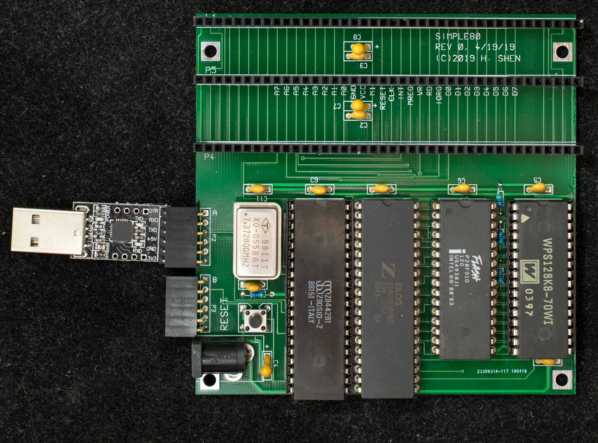
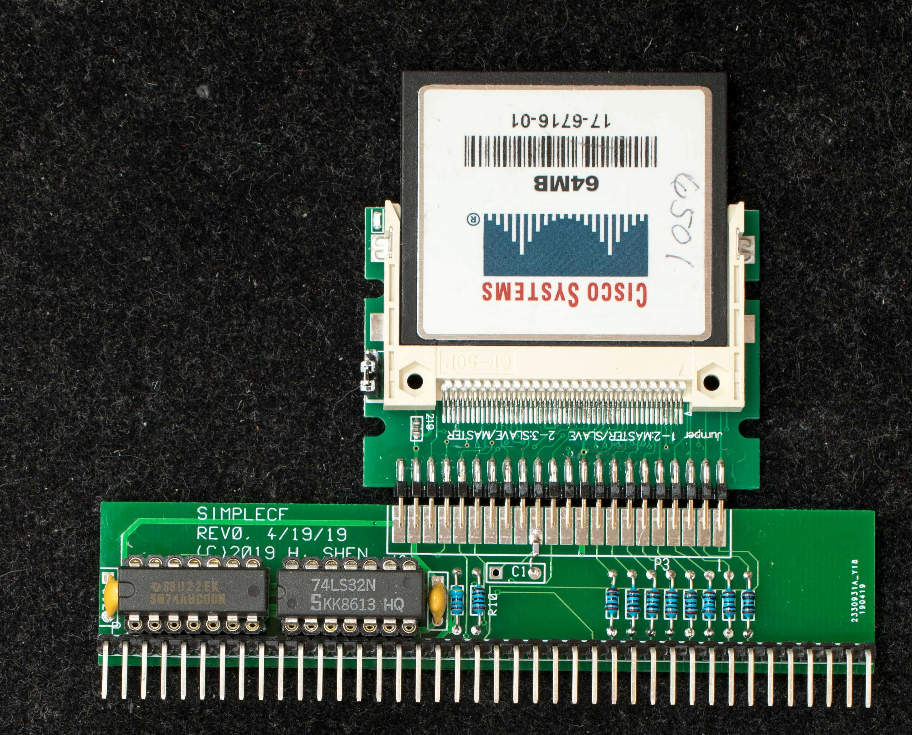
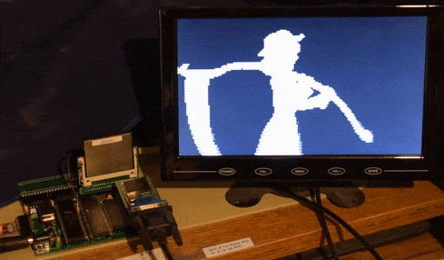

# Simple Z80 SBC without glue logic
This design was inspired by low-cost Z80 kit listed on eBay. The motivation is to build a CP/M-ready, RC2014-compatible Z80 SBC with part cost of about $20. 

### Features
- Z80 at 7.3728MHz
- Dual serial port SIO
- 128K RAM
- 64K PROM or EEPROM
- CP/M ready
- Three classic RC2014 expansion connectors
- 100mm X 100mm pc board
- No glue logic design
### Theory of operation
This is a classical microprocessor design with CPU, I/O, RAM and ROM but with one unusual feature: To keep the part count at minimal, both RAM and ROM are chip selected when Z80 is accessing the memory space. To boot up, only ROM's output enable is asserted at reset; In this mode RAM is selected but write-only; the first routine in ROM firmware is to read its own code and write it back into the same location for the entire ROM program; this unusual operation does not affect the read-only ROM, but duplicate the ROM program into the write-only RAM. When the duplication operation is completed, the firmware enable the RAM's output enable and disable ROM's output enable so now the program is running in RAM.

### Design Information
- [Schematic](simple80_rev0_scm.pdf) of Simple80 Motherboard
- PC board [Gerber files](simple80_r0_gerber.zip) of Simple80 motherboard. The pc boards were made by JLCPCB
- Bill of Materials for Simple80

- [Schematic](simplecf_rev0_scm.pdf) of SimpleCF, a simple compact flash interface for Simple80
- PC board [Gerber files](simplecf_r0_gerber.zip) of SimpleCF, a simple compact flash interface for Simple80
- Bill of Materials for SimpleCF

### Software
- [Simple80 Monitor rev 0.92](software/simple80_rev0_software_mon_v0_92_improved_hitechc.zip), ←(updated 11/21/23) a basic monitor for Simple80. Use this monitor to initialize CF disk and load CP/M2.2 and CP/M3. This monitor will work with both rev0 and rev1 PC board of Simple80 with or without R16 engineering change. Rev0.91 supports [Ladislau's improved HiTech C compiler](https://github.com/Laci1953/HiTech-C-compiler-enhanced) and TE editor.
- [SCMonitor for Simple80](software/simple80_r0_software_loadable_scmonitor_startrek.hex). This is Steve Cousin's SCMonitor ported to Simple80. Startrek program is included in this port. To run Startrek, type 'wbasic' followed by 'run'. Please note this program is not to be burned into the boot flash; it is to be loaded into memory using Simple80 monitor followed by 'g0' monitor command to invoke SCMonitor.
- [CP/M2.2 for Simple80](software/simple80_rev0_cpm22.zip). This is the BIOS/CCP/BDOS ported to Simple80.
- [XMODEM](https://github.com/Plasmode/ZRCC/blob/main/rev1.0_rev1.1/software/cpm_software_xmodem.hex) is the file transfer program to bring in all CP/M programs from PC to Z80SBC64. While in monitor, send XMODEM.HEX as Intel Hex file, type 'b2' to boot into CP/M2.2, then type 'save 17 xmodem.com'. XMODEM.COM will be created as the first file on the CP/M disk. To invoke XMODEM to receive files, type 'xmodem filename /r' and go to the terminal program to send file via xmodem.
- [CPM22DRI](https://github.com/Plasmode/ZRCC/blob/main/rev1.0_rev1.1/software/cpm22dri.zip) is system files for CP/M2.2. Unzip the file to CPM22DRI.ARJ then use XMODEM to transfer it to CP/M. Once transferred, use unarj.com to decompress the files. CPM22DRI image is created using cpmtools.
- [unarj.com](https://github.com/Plasmode/ZRCC/blob/main/rev1.0_rev1.1/software/unarj.zip) is the CP/M program that decompresses CPM3ALL.ARJ and CPM22DRI.ARJ above. The command is “unarj e filename”
- [Zorkall](https://github.com/Plasmode/ZRCC/blob/main/rev1.0_rev1.1/software/CPM_zorkall.zip) is Zork1, Zork2, and Zork3 compressed with arj. Use unarj.com above to decompress.
- [HTC309](https://github.com/Plasmode/ZRCC/blob/main/rev1.0_rev1.1/software/CPM_htc309.zip) is version 3.09 of HiTech C that has been released into publica domain. It is compressed with arj, use unarj.com above to decompress
- CPM3, [cbios3](https://github.com/Plasmode/Simple80/blob/main/Rev0/software/simple80_software_cpm3_cbios3_scb.zip), non-banked version. A hardware bug in Simple80 prevents it from having banked memory.
- [CPM3 loader](https://github.com/Plasmode/Simple80/blob/main/Rev0/software/simple80_software_cpm3_ldrbios.zip). Load CPMLDR.HEX at the monitor and type 'g 1100' to start CP/M3.
- [CP/M 3 distribution files](https://github.com/Plasmode/Simple80/blob/main/Rev0/software/simple80_software__cmp3_distribution_files.zip). These are CPM3 executables as distributed by Digital Research. The Simple80 version of cpm3.sys is included.

### Instructions and Manuals
- [Getting Started](manual/Getting_started.md) with Simple80

For TeraTerm users this [zipped file](software/simple80_auto_install.zip) contains all CP/M software above plus a TeraTerm macro file that will automatically install all CP/M software in a new CF disk. Unzip the files in C;\teraterm\simple80 and run “newcf.ttl” macro in TeraTerm.

- [Instruction](manual/install_compile_cpm3.md) on compiling and installing CP/M3 on Simple80.

### Simple80 Applications
- [Playing "BadApple!"](software/BadApple_on_Simple80.md) on Simple80 by replacing 128KB RAM with VGAxRAM

