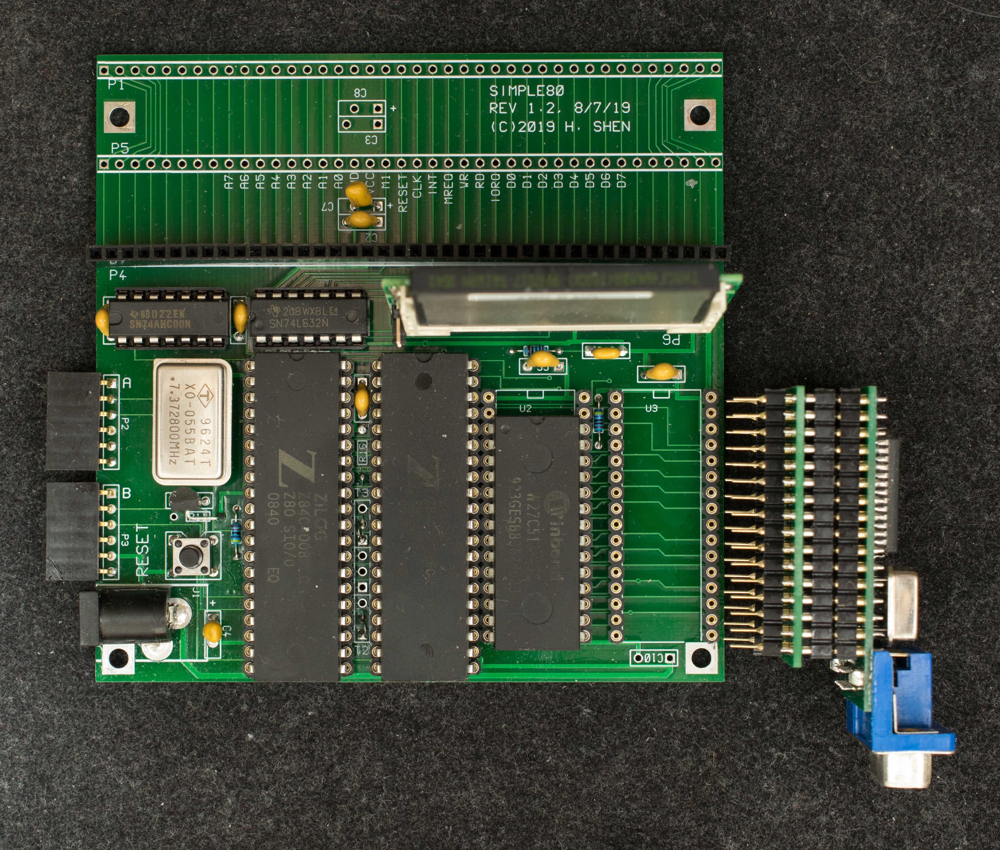

# BadApple! on Simple80
This project requires Simple80's 128KB RAM replaced with [VGAxRAM](https://www.retrobrewcomputers.org/doku.php?id=builderpages:plasmo:vgaxram)

The VGAxRAM displays 64 x 48 text; the resolution can be increased to 128×96 with interpolation by programming 16 fonts to represent the 16 possible permutation of 2×2 pixel array; thus each text character can represent 2×2 pixels. It takes 3 CF sectors (1.5KB) to represent a frame of picture. The original BadApple video is recorded at 20 frames a second, so each frame is 50mS. Using “put” system call to push every video byte to VGAxRAM, I measured 40mS to display 1.5KB. The software (BadAppleVGALoRAM, see the software section below) inserted 10mS delay between each frame to achieve 20 frames/sec. However, this is with 14.7MHz Z80; it is not possible to achieve 20 frames/s with the standard 7.37MHz Z80.

BadAppleVGAHiRAM resides in high 64KB memory so it has direct access to VGAxRAM (not using “put” system call). It is able to write 1.5KB in 17.6mS (Z80 at 14.7MHz), 2.3 times faster than using “put” system call. It should be possible to play vido at 20 frames/sec with standard 7.37MHz Z80.

Discussion about VGAxRAM on Simple80 can be found [here](https://groups.google.com/g/rc2014-z80/c/LVgNzuBvCDM) starting from Jan 14, 2023

Software
BadApple image file. This must be first file of a newly formatted CP/M drive D. This forces the file to be contiguous and reside on CF track $c0, sector $20

BadApple player resides on high 64KB RAM of Simple80. To load this file into high memory, enter the following 2 commands at monitor prompt:

o 11 03

o 40 03

Then load BadAppleVGAHiRAM.hex and start execution from $1000.

BadApple player resides on default low 64KB RAM of Simple80. Load BadAppleVGALoRAM.hex and execute from $1000

VGAxRAM splash, display a screenful of text on VGA monitor. Load VGAxRAM_splash.hex and execute from $1000

builderpages/plasmo/simple80/simple80_project/bad
