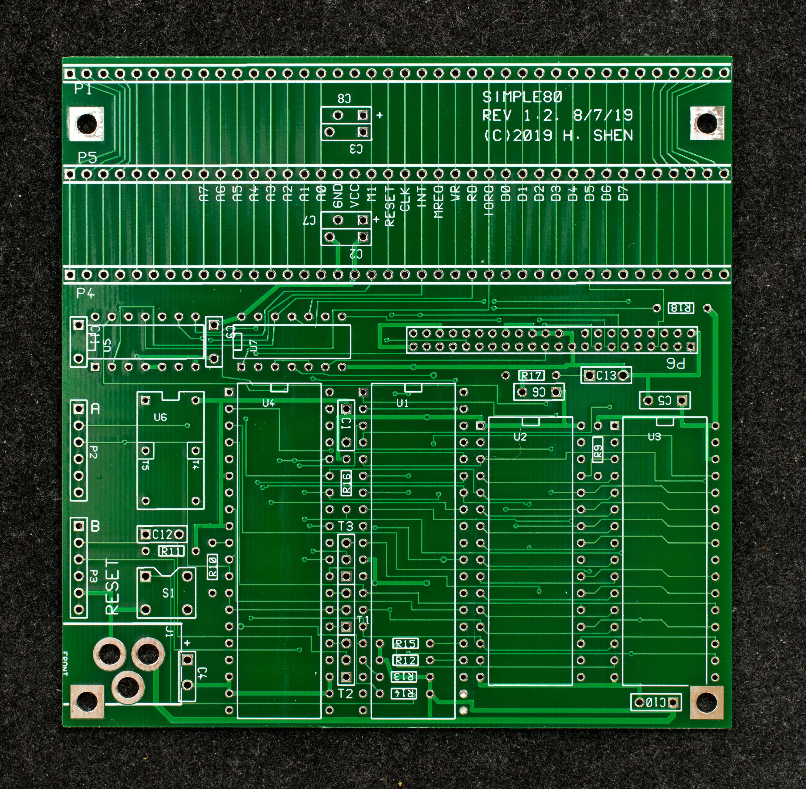
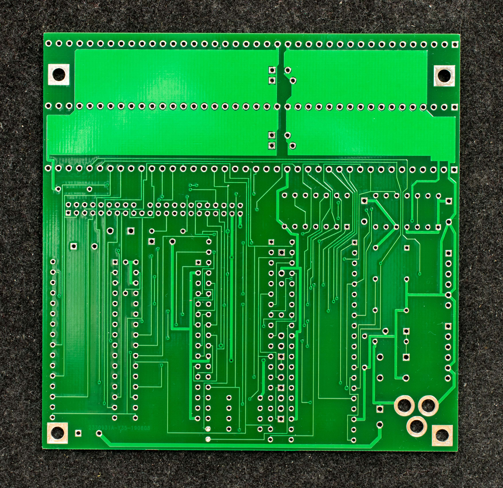
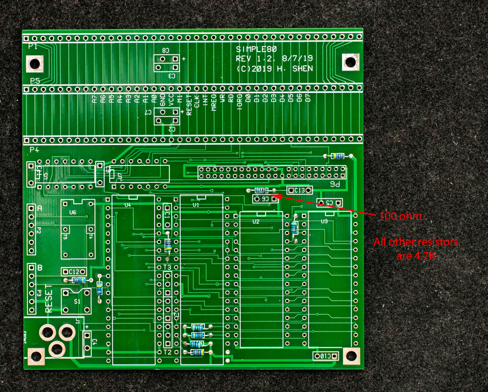
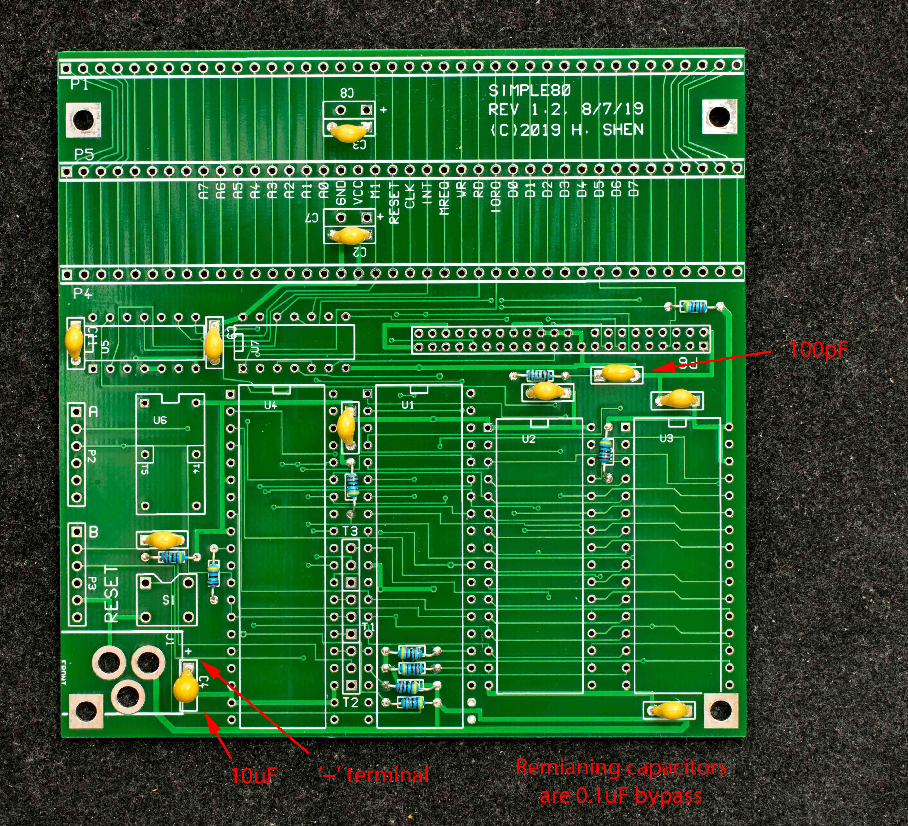
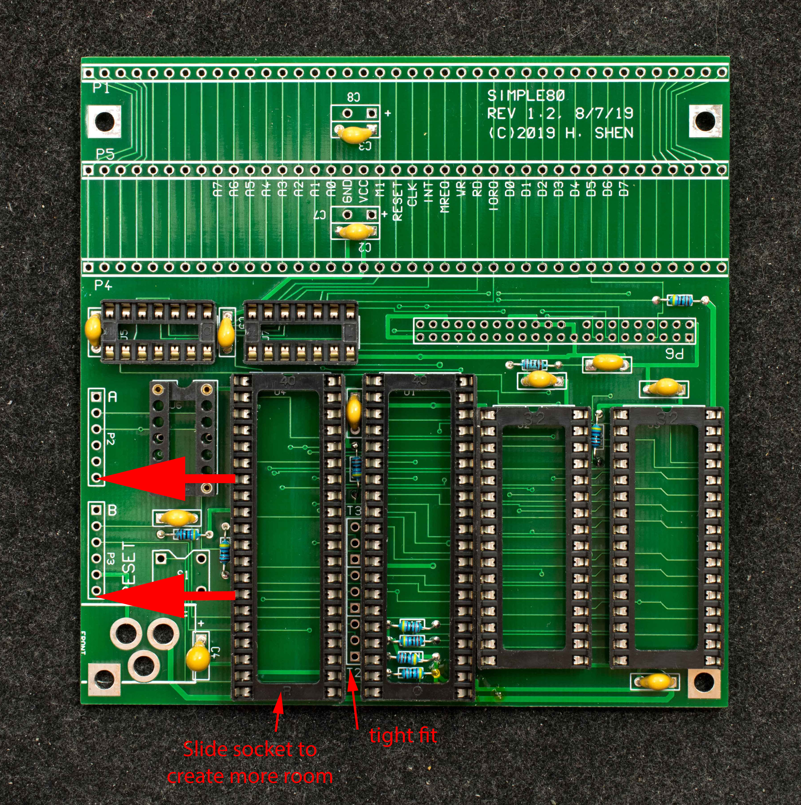
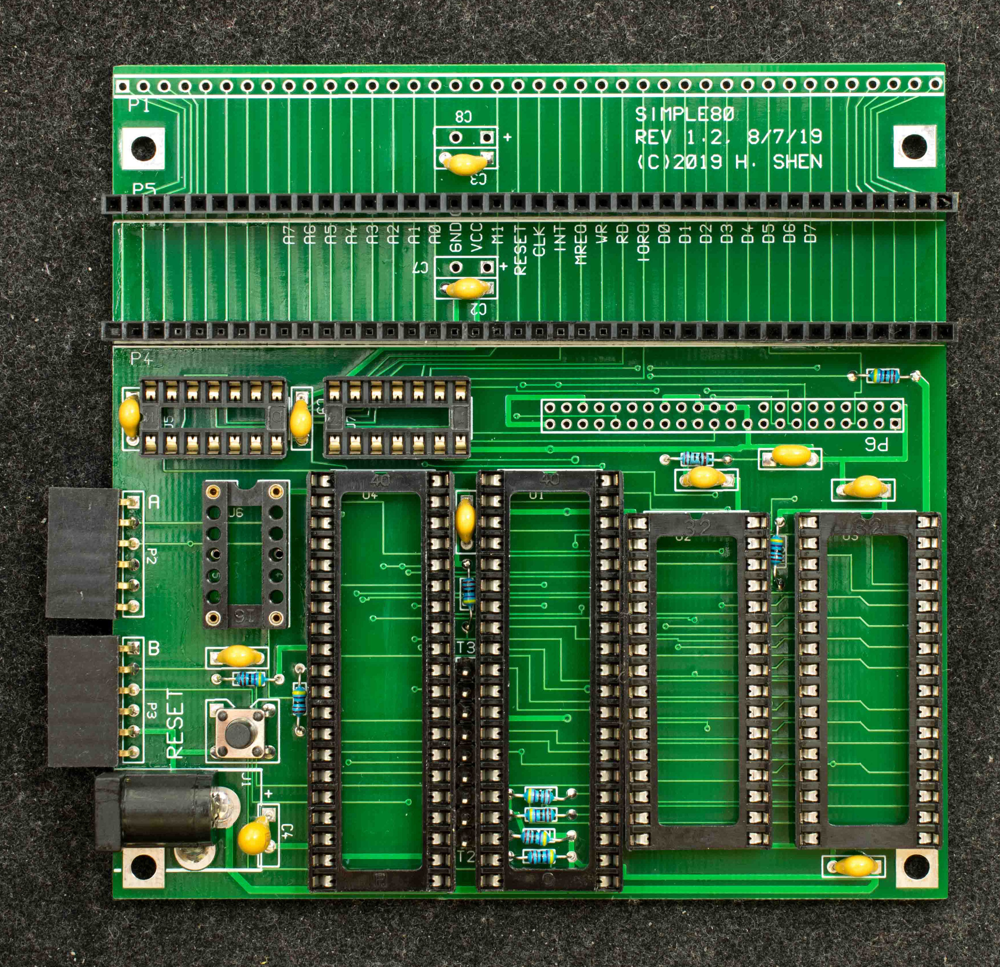
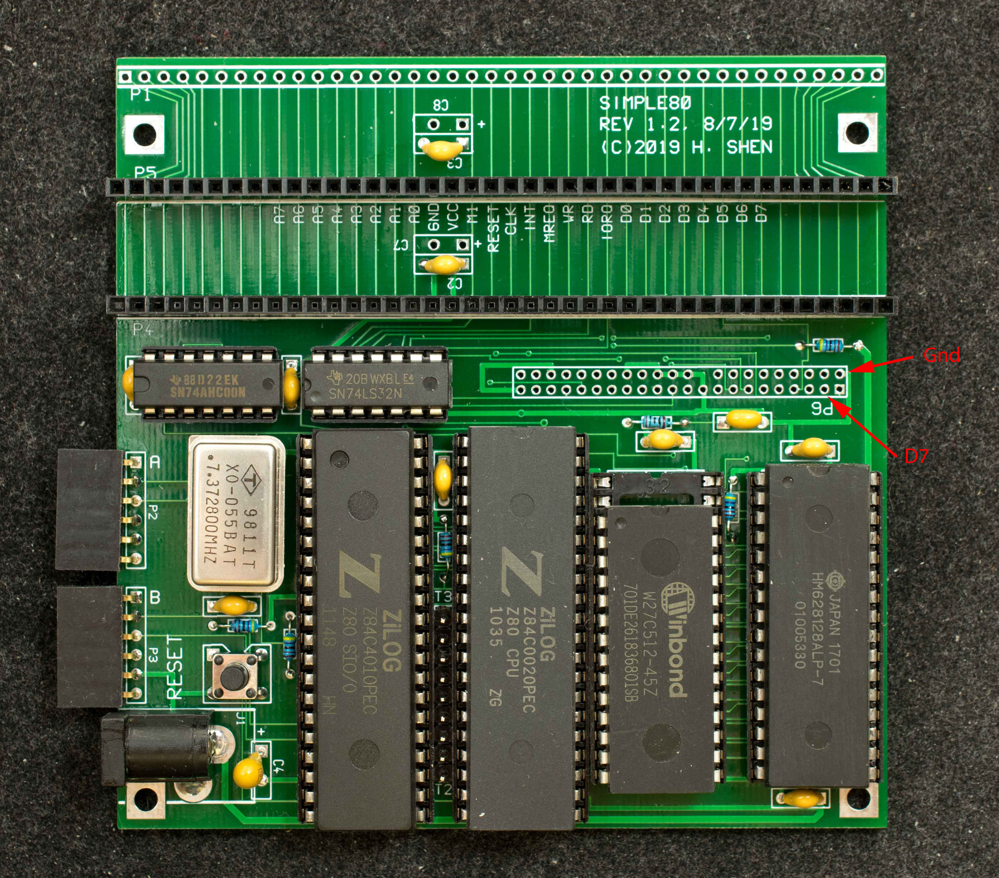

# Pictorial Assembly Guide for Simple80 Rev1.2
Blank board, component side

Blank board, solder side

Resistors are all 4.7K except R17

Capacitors are 0.1uF except C4 (10uF tantalum) and C13 (100pF ceramic)

Install IC sockets. The spacing between U1 and U4 is tight, so slide socket for U4 away from U1 to create more space for jumper blocks between U1 and U4.

Finish up except CF adapter

Board will boot and sign on without CF adapter. However, it will hang waiting for CF disk ready.

Inserting a 4.7K resistor between D7 and GND as indicated with red arrows will enable boot to complete.

