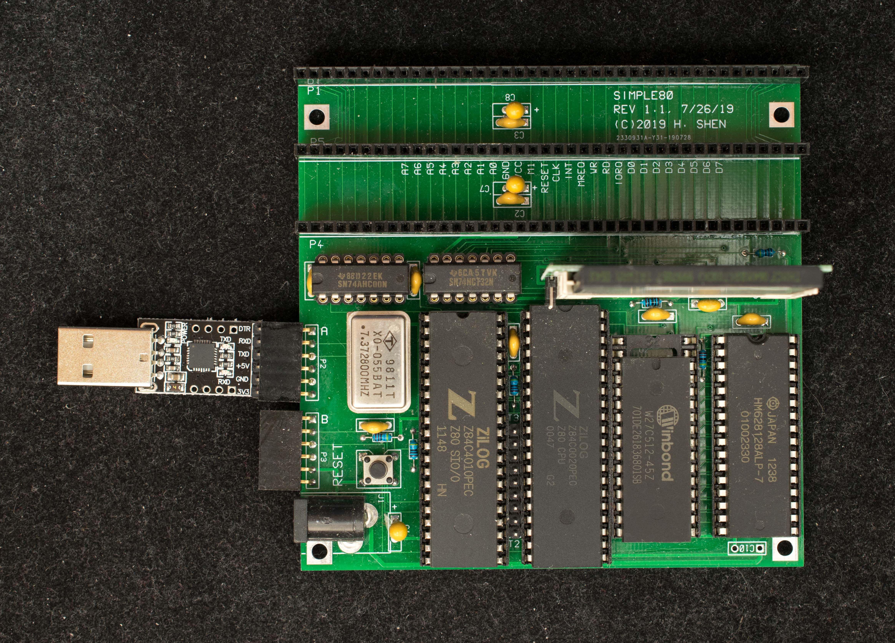

# Simple80 Rev1 
This is rev 1 of Simple80 with the compact flash interface integrated on board. The motherboard has all necessary hardware to run CP/M. It is no longer zero glue logic like the Simple80, but is software compatible with the original Simple80.

### Features
- Z80 at 7.3728MHz
- Dual serial port SIO
- 128K RAM
- 64K PROM or EEPROM
- CP/M 2.2 and CP/M 3
- Three classic RC2014 expansion connectors
- 100mm X 100mm pc board
- Compact flash interface

### Theory of operation
This is a classical microprocessor design with CPU, I/O, RAM and ROM but with one unusual feature: To keep the part count at minimal, both RAM and ROM are chip selected when Z80 is accessing the memory space. To boot up, only ROM's output enable is asserted at reset; In this mode RAM is selected but write-only; the first routine in ROM firmware is to read its own code and write it back into the same location for the entire ROM program; this unusual operation does not affect the read-only ROM, but duplicate the ROM program into the write-only RAM. When the duplication operation is completed, the firmware enable the RAM's output enable and disable ROM's output enable so now the program is running in RAM.

### Design Information
- Schematic of Simple80 Motherboard
- PC board Gerber files of Simple80 motherboard. The pc boards were made by JLCPCB
- Bill of Materials for Simple80

### Software
Simple80 rev1 is software compatible with Simple80. Please see Software section of Simple80.

### Manuals
Pictorial assembly guide for Simple80, rev1.2

